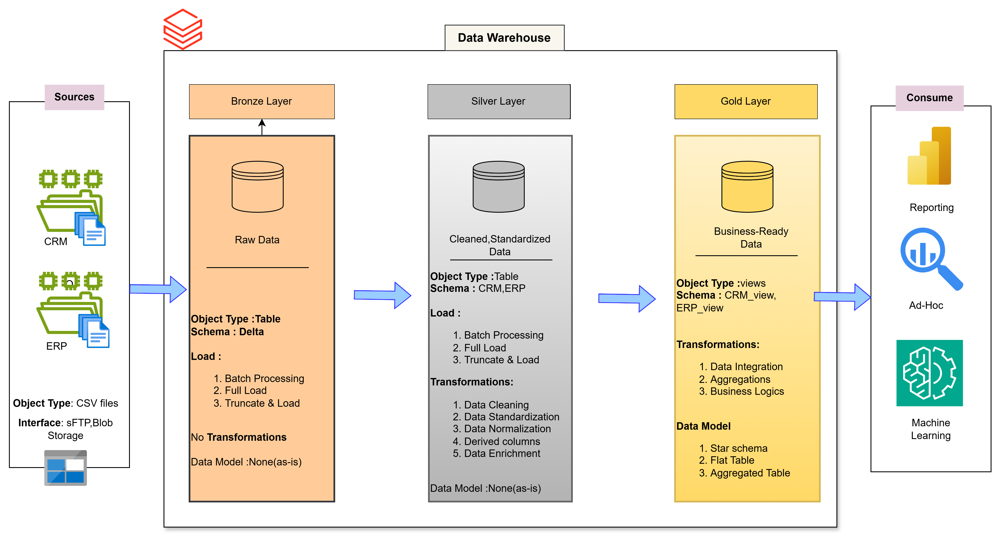

# Data Warehouse and Analytics Project using databricks community edition
Welcome to the Data Warehouse and Analytics Project repository

 ## Project Requirements

 > Building the Data Warehouse (Data Engineering)

 ## Objective

 > Develop a data warehouse using databricks to consolidate sales data,enabling analytical reporting and information decision making
 

 ## Specification

1. **Data source**  : Import data source from 2 system (ERP AND CRM) provided as CSV files.
2. **Data Quality** : Clease and resolve data quality issues prior to analysis.
3. **Integration** : Combined both sources into single.
4. **Scope** :  Focus on the latest dataset only.
5. **Documentation** : Provide clear documentation of the data model to support both business stakeholders and analytics teams 

----------------------------------------------------------------------------------------------------------------------------------

#### Data Architecture (Draw.io)

Url : https://app.diagrams.net/?src=about#HPRAKHER0522%2FSQL_DATABASE%2Fmain%2FDatawarehouse_Architecture.png#%7B%22pageId%22%3A%22nOGBFYduK7nkKwmtMRqq%22%7D

-------------------------------------------------------------------------------------------------------------------------