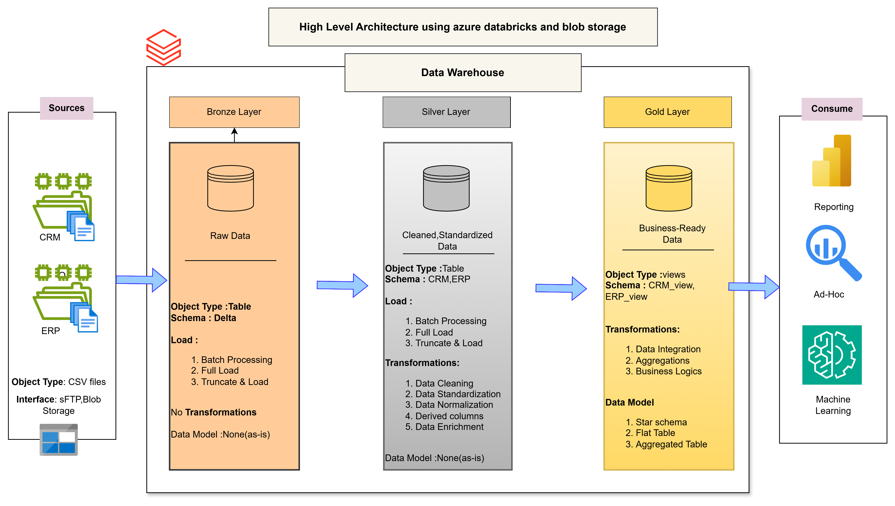

# Data Warehouse and Analytics Project using databricks community edition
Welcome to the Data Warehouse and Analytics Project repository

 ## Project Requirements

 > Building the Data Warehouse (Data Engineering)

 ## Objective

 > Develop a data warehouse using databricks to consolidate sales data,enabling analytical reporting and information decision making
 

 ## Specification

1. **Data source**  : Import data source from 2 system (ERP AND CRM) provided as CSV files.
2. **Data Quality** : Clease and resolve data quality issues prior to analysis.
3. **Integration** : Combined both sources into single.
4. **Scope** :  Focus on the latest dataset only.
5. **Documentation** : Provide clear documentation of the data model to support both business stakeholders and analytics teams 

----------------------------------------------------------------------------------------------------------------------------------

#### Data Architecture (Draw.io)

Architecture for this projects follow medallion architecture Bronze,silver,gold layers

Url : https://app.diagrams.net/?src=about#HPRAKHER0522%2FSQL_DATABASE%2Fmain%2FDatawarehouse_Architecture.png#%7B%22pageId%22%3A%22nOGBFYduK7nkKwmtMRqq%22%7D

-------------------------------------------------------------------------------------------------------------------------

##### Project management using notion 

Url : https://secret-light-d79.notion.site/Data-Warehouse-Project-21951ca3163280209c1df28ba920f37e?pvs=143

##### Define naming convention 

*** General Principles ***

Naming case: [camelCase,SCREAMING_SNAKE_CASE,kebab-case,snake_case]  - use snake_case

*** Table naming conventions***

<!-- Bronze layer  --> [<sourcesystem>_<entity>]
  * [sourcesystem] : Name of sourcesystem(crm,erp)
  * [entity]:Exact table name from source system.
  * [Example] : crm_customer_info : customer information from crm system
<!-- Bronze layer  -->

<!-- Silver layer  --> [<sourcesystem>_<entity>]
  * [sourcesystem] : Name of sourcesystem(crm,erp)
  * [entity]:Exact table name from source system.
  * [Example] : crm_customer_info : customer information from crm system
<!-- Silver layer  -->

<!-- Gold layer  --> All name use meaningful,businsess aligned names ,starting with category
* [<category>_<entity>]
  * [category] : Desc role of the table such as dim ,fact
  * [entity]:descriptive name of table ,aligned with business domain(customers,product,sales)
  * [Example] : dim_customers,fact_sales

| Pattern | Meaning           | Examples                 |
|---------|-------------------|--------------------------|
| dim_    | dimension table   | dim_customer,dim_product |
| fact_   | fact table        | fact_tables              |
| agg_    | aggregation table | agg_customers            |

<!-- Gold layer  -->

**** Column name convention***

Example :  Key column : customer_key

